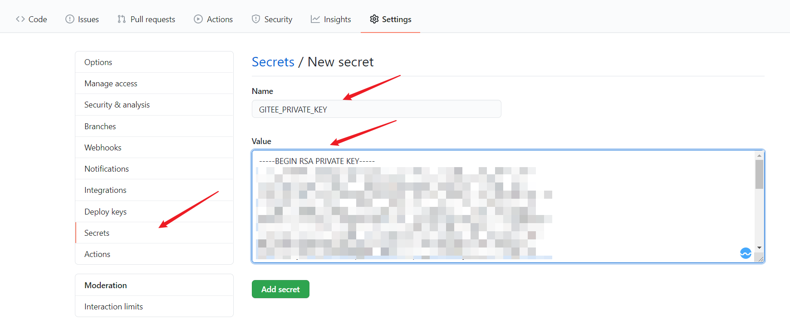
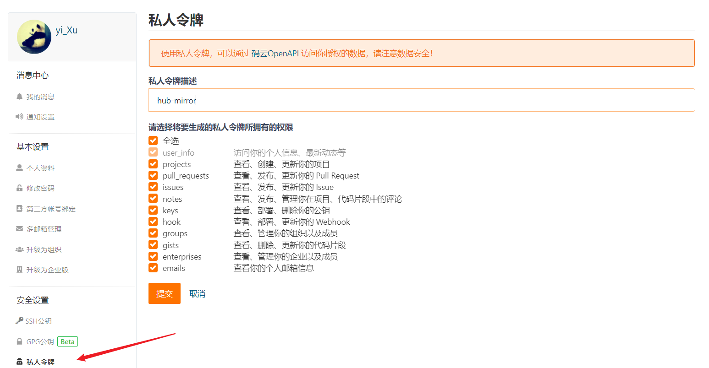
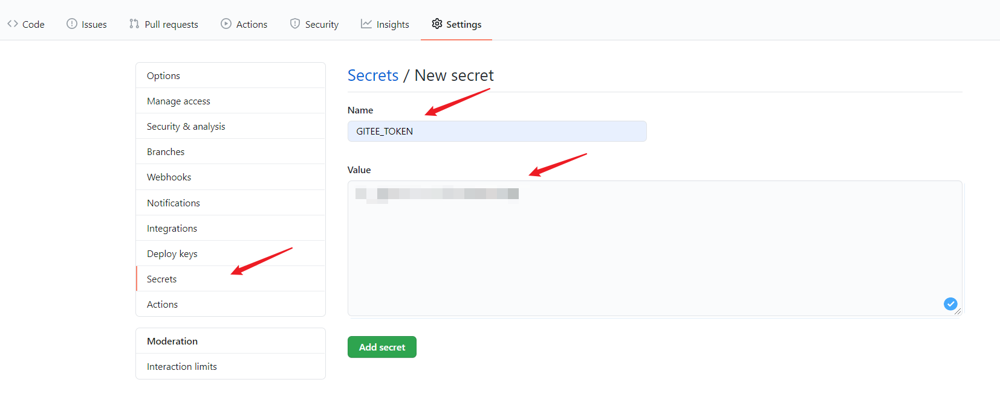

## hub-mirror


[简体中文](./README.md) | [English](./README_EN.md)

使用 [github action - hub-mirror-action](https://github.com/Yikun/hub-mirror-action) 的模板仓库，可以管理当前 `GitHub` 与其他的 `hub` 的存储库的镜像同步。

PS：当前的模板仓库仅使用了部分参数配置同步指令，`.github/workflows/sync2gitee.yml` 的参数需要自行修改和配置以完成个人的流程使用。

## 目录

- [hub-mirror](#hub-mirror)
- [目录](#目录)
- [配置参数](#配置参数)
  - [`src`(需要)](#src需要)
  - [`dst`(需要)](#dst需要)
  - [`dst_key`(需要)](#dst_key需要)
    - [设置 `dst_key`](#设置-dst_key)
  - [`dst_token`(需要)](#dst_token需要)
    - [设置 `dst_token`](#设置-dst_token)
  - [`static_list`(建议)](#static_list建议)
- [单仓库使用](#单仓库使用)
- [鸣谢](#鸣谢)
- [许可证](#许可证)

## 配置参数

### `src`(需要)

需要被同步的源端账户名，例如 `github/yi-Xu-0100` ，是 `GitHub` 中 `yi-Xu-0100` 账户。


### `dst`(需要)

需要同步到的目的端账户名，例如 `gitee/yiXu0100` ，是 `Gitee` 中 `yiXu0100` 账户。


### `dst_key`(需要)

`dst_key` 是用于目的端上传代码的 `SSH key` ，用于上传代码，你可以在 [这里](https://github.com/settings/keys) 中获得 `GitHub` 的 `SSH` 密钥配置，在 [这里](https://gitee.com/profile/sshkeys) 中获得 `Gitee` 的 `SSH` 密钥配置。

#### 设置 `dst_key`

1. 安装 `Git` 并启动 `GitBash`
2. 运行以下命令以生成 `SSH` 密钥对（图片中使用的默认配置，即跳过所有设置）

    ``` sh
    ssh-keygen -t rsa
    ```

    

3. 根据第二步获得的路径，将密钥对分别添加到两个库中（以 `GitHub` 和 `Gitee` 为例）
    1. 将私钥（ `id_rsa` ）添加到 `GitHub` 存储库。通过 `GitHub` **仓库设置** 中的 `Secrets` 创建一个 `GITEE_PRIVATE_KEY` 变量，然后将私钥内容复制到值区域。

        

    2. 将公钥（ `id_rsa.pub` ）添加到 `Gitee` 存储库。通过 `Gitee` **个人设置** 中的 `SSH公钥` 创建一个 `hub-mirror` 变量，然后将公钥内容复制到值区域。

        

### `dst_token`(需要)

`dst_token` 是 创建仓库的 `API tokens`， 用于自动创建不存在的仓库。你可以在 [这里](https://github.com/settings/tokens) 中获得 `GitHub` 令牌，并在 [这里](https://gitee.com/profile/personal_access_tokens) 中获得 `Gitee` 令牌。

#### 设置 `dst_token`

以 `Gitee` 为例，获取令牌后添加到 `GitHub` 中。

1. 通过 `Gitee` **个人设置** 中的 `私人令牌` 生成 `GITEE_TOKEN`，并将令牌内容复制到值区域。

   PS：令牌仅出现一次，请保存它（它可以生成多次）。

    

2. 将令牌添加到 `GitHub` 存储库，通过 `GitHub` **仓库设置** 中的 `Secrets` 创建一个 `GITEE_TOKEN` 变量，并将私钥内容复制到值区域。

   

### `static_list`(建议)

`static_list` 配置后，仅同步静态列表，不会再动态获取需同步列表（黑白名单机制依旧生效），如“repo1,repo2,repo3”。模板仓库中的 `static_list` 使用的 `${{ github.event.repository.name }}` 仅仅指定了当前仓库（即模板仓库）。同时，设置仓库名称时需要注意以下问题：

- 仓库名称注意大小写和符号。
- 当前的 `hub-mirror-action@v0.09` 会对所有的仓库进行镜像同步，会在另一个 `hub` 中创建 `GitHub` 下克隆的所有仓库。
- 当前的 `hub-mirror-action@v0.09` 对私有仓库**无法完成**镜像同步，可能会打断同步过程，造成部分仓库未同步。

## 单仓库使用

由于 `static_list` 仅设置了当前仓库。可以不增加参数，而选择将 `.github/workflows/sync2gitee.yml` 放置在任意仓库的**相同路径**下，以实现仅同步含有该文件的仓库的配置。

PS：你同样需要 [配置参数](#配置参数) 。

## 鸣谢

- [Yikun/hub-mirror-action](https://github.com/Yikun/hub-mirror-action)
- [ShixiangWang/sync2gitee](https://github.com/ShixiangWang/sync2gitee)

## 许可证

[MIT](./LICENSE)
