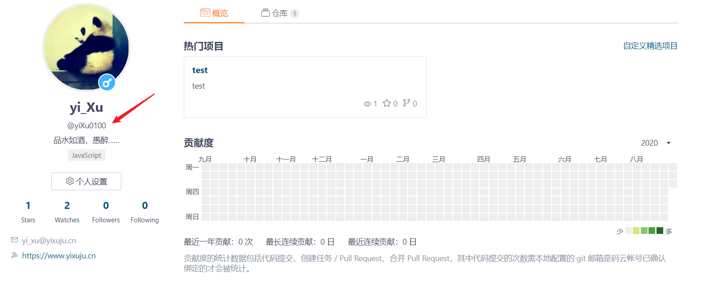

## hub-mirror


[English](./README_EN.md) | [简体中文](./README.md)

Template usage repository of [github action-hub-mirror-action](https://github.com/Yikun/hub-mirror-action), you can manage the mirror repositories actions between `GitHub` with other `hub`.

## Configuration parameter

### `src`(required)

`src` is source account, such as `github/yi-Xu-0100`, is the `Github` account `yi-Xu-0100`.


### dst(required)

`dst` is destination account, such as `gitee/yi-Xu-0100`, is the `Gitee` account `yi-Xu-0100`.



### `dst_key`(required)

`dst_key` the `SSH` key to push code in destination account, You can get the `Github SSH key` in [here](https://github.com/settings/keys)，the `Gitee SSH key` in [here](https://gitee.com/profile/sshkeys).

#### Set `dst_key`

1. install `Git` and launch `GitBash`
2. Run the following command to generate an `SSH` key pair (The default configuration used by the picture, that is, skip all settings).

    ``` sh
    ssh-keygen -t rsa
    ```

    

3. According to the path obtained in the second step, add the key pair to the two libraries respectively (take `GitHub` and `Gitee` as examples)
    1. Add the private key (`id_rsa`) to the `GitHub` repository. Create a `GITEE_PRIVATE_KEY` variable through the `Secrets` in the `GitHub` **repository settings**, and copy the private key content to the value area.

        

    2. Add the public key (`id_rsa.pub`) to the `Gitee` repository. Create a `hub-mirror` variable through the `SSH Public Key` in the `Gitee` **personal settings**, and copy the public key content to the value area.

        

### `dst_token`(required)

`dst_token` is the `API` token to create non-existent repo. You can get `Github` token in [here](https://github.com/settings/tokens), and the `Gitee` in [here](https://gitee.com/profile/personal_access_tokens).

#### Set `dst_token`

Take `Gitee` as an example, get the token and add it to `GitHub`.

1. Generate a `GITEE_TOKEN` through `personal access token` in the `Gitee` **personal settings**, and copy the token content to the value area.

   The token only appears once, please save it(it can be generated multiple times).

   

2. Add the token to the `GitHub` repository, create a `GITEE_TOKEN` variable through the `Secrets` in the `GitHub` **repository settings**, and copy the private key content to the value area.

   

## Thanks

- [Yikun/hub-mirror-action](https://github.com/Yikun/hub-mirror-action)
- [ShixiangWang/sync2gitee](https://github.com/ShixiangWang/sync2gitee)

## LICENSE

[MIT](./LICENSE)
